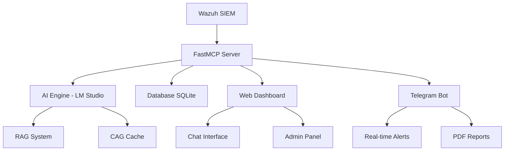

# 🛡️ AISOC MCP - AI Security Operations Center
### *AI-Powered Security Management Platform with Model Context Protocol*

[](https://python.org)
[](https://github.com/phdowling/fastmcp)
[](https://wazuh.com)
[](https://telegram.org)
[](https://lmstudio.ai)

---

## � **Daftar Isi**
- [🎯 Pengenalan](#-pengenalan)
- [⭐ Fitur Utama](#-fitur-utama)
- [🏗️ Arsitektur](#️-arsitektur)
- [📋 Prerequisites](#-prerequisites)
- [🚀 Instalasi](#-instalasi)
- [⚙️ Konfigurasi](#️-konfigurasi)
- [🎮 Panduan Penggunaan](#-panduan-penggunaan)
- [🔧 FastMCP Tools](#-fastmcp-tools)
- [📊 Database Schema](#-database-schema)
- [🤖 AI Capabilities](#-ai-capabilities)
- [📱 Telegram Bot](#-telegram-bot)
- [🌐 Web Dashboard](#-web-dashboard)
- [🧪 Testing](#-testing)
- [📚 Dokumentasi](#-dokumentasi)
- [🚨 Troubleshooting](#-troubleshooting)
- [🤝 Contributing](#-contributing)

---

## 🎯 **Pengenalan**

**AISOC MCP** (AI Security Operations Center - Model Context Protocol) adalah platform manajemen keamanan terdepan yang mengintegrasikan **Wazuh SIEM** dengan **AI-powered analysis** menggunakan **FastMCP protocol**. Platform ini menyediakan monitoring keamanan real-time, analisis log yang cerdas, dan deteksi ancaman otomatis.

### 🔥 **Mengapa AISOC MCP?**
- 🚀 **AI-Native**: Built-in AI untuk analisis keamanan
- ⚡ **Real-time**: Monitoring dan alerting langsung
- 🧠 **Smart Analysis**: RAG + CAG untuk analisis kontekstual
- 📱 **Multi-Interface**: Web, Telegram, dan API
- 🔒 **Privacy-First**: AI lokal dengan LM Studio
- 📊 **Comprehensive**: 29 tools terintegrasi

---

## ⭐ **Fitur Utama**

### �️ **Core Components**
| Komponen | Deskripsi | Status |
|----------|-----------|--------|
| **FastMCP Server** | AI-powered security analysis dengan 29 tools | ✅ Ready |
| **Web Dashboard** | Interactive interface dengan chat AI | ✅ Ready |
| **Telegram Bot** | Real-time alerts & Q&A capabilities | ✅ Ready |
| **Database System** | Comprehensive logging & caching | ✅ Ready |
| **Config Manager** | Centralized configuration dengan validasi | ✅ Ready |

### 🤖 **AI Capabilities**
- **🔍 RAG (Retrieval-Augmented Generation)**: Analisis keamanan berbasis konteks
- **💾 CAG (Cache-Augmented Generation)**: Sistem caching cerdas untuk performa optimal
- **🎯 Semantic Search**: Analisis log berbasis vector dan similarity search
- **🏠 LM Studio Integration**: Deployment AI model lokal untuk privasi maksimal

### 🛡️ **Security Features**
- **📡 Real-time Monitoring**: Analisis security event berkelanjutan
- **🚨 Automated Alerting**: Deteksi ancaman dan notifikasi cerdas
- **📝 Log Analysis**: Analisis log keamanan berbasis AI
- **📄 Report Generation**: Laporan PDF otomatis dengan insight keamanan
- **👥 Agent Management**: Monitoring agent Wazuh yang komprehensif

---

## 🏗️ **Arsitektur**



### 📂 **Struktur Project**
```
AISOC MCP/
├── 🎯 src/
│   ├── api/
│   │   ├── wazuh_fastmcp_server.py    # 🚀 Core FastMCP server
│   │   └── wazuh_realtime_server.py   # 📡 Real-time monitoring
│   ├── webapp/
│   │   ├── webapp_chatbot.py          # 🌐 Main web app
│   │   ├── admin.py                   # ⚙️ Admin interface
│   │   └── templates/                 # 🎨 HTML templates
│   ├── telegram/
│   │   ├── telegram_security_bot.py   # 🤖 Bot utama
│   │   └── telegram_report_generator.py # 📊 Report generator
│   └── database/                      # 💾 Database utilities
├── ⚙️ config/
│   ├── config_manager.py              # 🎛️ Configuration manager
│   └── config.json                    # 📝 Main config
├── 💾 data/
│   ├── chat_history.db                # 💬 Chat database
│   └── wazuh_archives.db              # 📋 Wazuh logs
├── 📚 docs/                           # 📖 Dokumentasi lengkap
├── 🧪 tests/                          # 🔍 Testing suite
└── 🧠 cag_cache/                      # 🚀 AI knowledge cache
```

---

## 📋 **Prerequisites**

### �️ **System Requirements**
- **OS**: Windows 10/11, Linux, macOS
- **Python**: 3.8 atau lebih tinggi
- **RAM**: Minimum 8GB (Recommended 16GB+)
- **Storage**: 10GB free space
- **Network**: Internet connection untuk setup awal

### 📦 **Required Software**
| Software | Versi | Deskripsi |
|----------|-------|-----------|
| **Python** | 3.8+ | Runtime environment |
| **Wazuh Manager** | 4.x+ | SIEM platform |
| **LM Studio** | Latest | Local AI inference |
| **Git** | Latest | Version control |

### 🔑 **API Keys & Tokens**
- **Telegram Bot Token** (dari @BotFather)
- **Wazuh API Credentials**
- **LM Studio API Key** (jika diperlukan)

---

## 🚀 **Instalasi**

### **Step 1: Clone Repository**
```powershell
# Clone repository
git clone https://github.com/urtir/AISOC-MCP.git
cd AISOC-MCP
```

### **Step 2: Setup Python Environment**
```powershell
# Buat virtual environment
python -m venv aisoc_env

# Aktivasi virtual environment
# Windows PowerShell:
.\aisoc_env\Scripts\Activate.ps1
# Windows CMD:
# aisoc_env\Scripts\activate.bat
```

### **Step 3: Install Dependencies**
```powershell
# Upgrade pip
python -m pip install --upgrade pip

# Install requirements
pip install -r requirements.txt

# Verify installation
pip list
```

### **Step 4: Setup LM Studio**
1. **Download & Install**: [LM Studio](https://lmstudio.ai)
2. **Download Model**: Pilih model seperti `qwen2.5-1.5b` atau `llama-3.2-1b`
3. **Start Server**: Jalankan server di `http://localhost:1234`

### **Step 5: Setup Wazuh**
```bash
# Install Wazuh (Linux example)
curl -sO https://packages.wazuh.com/4.x/wazuh-install.sh
sudo bash ./wazuh-install.sh -a

# Verify Wazuh is running
curl -k -X GET "https://localhost:55000/" -H "Authorization: Bearer $TOKEN"
```

### **Step 6: Database Migration**
```powershell
# Migrate database
python migrate_database.py

# Verify database
python tests/check_db.py
```
---

## ⚙️ **Konfigurasi**

### **Step 1: Environment Variables**
Buat file `.env` di root directory:
```bash
# LM Studio Configuration
LM_STUDIO_BASE_URL=http://localhost:1234/v1
LM_STUDIO_API_KEY=lm-studio
LM_STUDIO_MODEL=qwen2.5-1.5b-instruct

# Wazuh Configuration
WAZUH_API_URL=https://localhost:55000
WAZUH_USERNAME=wazuh-wui
WAZUH_PASSWORD=YourSecurePassword123

# Flask Configuration
FLASK_HOST=127.0.0.1
FLASK_PORT=5000
FLASK_SECRET_KEY=your-super-secret-key-here

# Telegram Configuration
TELEGRAM_BOT_TOKEN=1234567890:ABCdefGhIjKlMnOpQrStUvWxYz
TELEGRAM_CHAT_ID=your-chat-id
```

### **Step 2: Config.json Setup**
Edit `config/config.json`:
```json
{
  "services": {
    "fastmcp_server": {
      "enabled": true,
      "host": "127.0.0.1",
      "port": 8000,
      "lm_studio_url": "http://localhost:1234/v1"
    },
    "web_app": {
      "enabled": true,
      "host": "127.0.0.1",
      "port": 5000,
      "debug": false
    },
    "telegram_bot": {
      "enabled": true,
      "token": "${TELEGRAM_BOT_TOKEN}",
      "admin_chat_id": "${TELEGRAM_CHAT_ID}"
    }
  },
  "wazuh": {
    "api_url": "${WAZUH_API_URL}",
    "username": "${WAZUH_USERNAME}",
    "password": "${WAZUH_PASSWORD}",
    "verify_ssl": false
  }
}
```

### **Step 3: Telegram Bot Setup**
1. **Buat Bot**:
   - Chat dengan [@BotFather](https://t.me/BotFather)
   - Kirim `/newbot`
   - Ikuti instruksi dan dapatkan token

2. **Get Chat ID**:
   ```powershell
   # Start bot dulu, lalu jalankan:
   python tests/test_telegram_alerting.py
   ```

3. **Test Bot**:
   ```powershell
   # Test telegram functionality
   python src/telegram/telegram_security_bot.py
   ```

---

## 🎮 **Panduan Penggunaan**

### **🚀 Menjalankan AISOC MCP**

#### **Method 1: All-in-One (Recommended)**
```powershell
# Start all services
python scripts/start_all_services.py
```

#### **Method 2: Manual Service Start**
```powershell
# Terminal 1: Start FastMCP Server
python src/api/wazuh_fastmcp_server.py

# Terminal 2: Start Web App
python src/webapp/webapp_chatbot.py

# Terminal 3: Start Telegram Bot
python src/telegram/telegram_security_bot.py

# Terminal 4: Start Real-time Monitor
python src/api/wazuh_realtime_server.py
```

### **✅ Verifikasi Services**

#### **1. Check FastMCP Server**
```powershell
# Test FastMCP tools
python tests/test_tool_definition.py
```

#### **2. Check Web Application**
- Browse ke: `http://localhost:5000`
- Login dengan default credentials
- Test chat interface

#### **3. Check Telegram Bot**
- Start chat dengan bot
- Kirim `/start`
- Test command `/help`

#### **4. Check Database**
```powershell
# Verify database integrity
python tests/check_db.py
```

Konfigurasi utama dilakukan melalui file `config/config.json`:

```json
{
  "lm_studio": {
    "base_url": "http://192.168.56.1:1234/v1",
    "api_key": "lm-studio",
    "model": "qwen/qwen3-1.7b"
  },
  "wazuh": {
    "api_url": "https://localhost:55000",
    "username": "wazuh-wui",
    "password": "your-password",
    "verify_ssl": false
  },
  "flask": {
    "host": "127.0.0.1",
    "port": 5000,
    "debug": false,
    "secret_key": "your-secret-key"
  },
  "telegram": {
    "bot_token": "your-bot-token",
    "chat_id": "your-chat-id"
  }
}
```

### Detailed Configuration

Untuk konfigurasi lengkap, lihat:

- `docs/COMPLETE_VARIABLES_LIST.md` - Daftar lengkap variabel konfigurasi
- `docs/HARDCODED_CONFIG_ANALYSIS.md` - Analisis konfigurasi hardcoded

## 🔧 Usage

### Web Interface

1. **Access Dashboard**: `http://localhost:5000`
2. **Login** dengan kredensial yang dikonfigurasi
3. **Monitor** security events di dashboard
4. **Generate Reports** melalui menu reporting

### Telegram Bot

1. **Start Bot**: Jalankan `src/telegram/telegram_security_bot.py`
2. **Add Bot** ke grup Telegram Anda
3. **Subscribe** untuk notifikasi real-time
4. **Query Logs** dengan perintah natural language

### API Access

FastMCP server menyediakan tools untuk:

- `check_wazuh_log` - Query dan analisis log keamanan
- `list_agents` - Daftar dan kelola agents
- `get_api_info` - Informasi API Wazuh
- Dan banyak tools lainnya...

## 📚 Documentation

### Core Documentation

- `docs/FastMCP_Documentation.md` - Dokumentasi FastMCP lengkap
- `docs/Wazuh_API_Documentation.md` - Dokumentasi Wazuh API
- `docs/CACHE_AUGMENTED_GENERATION_CAG.md` - Implementasi CAG

### System Documentation

- `docs/ALERT_SYSTEM_README.md` - Sistem alert real-time
- `docs/RAG_TO_CAG_MIGRATION.md` - Migrasi dari RAG ke CAG

## 🏗️ Architecture

### Technology Stack

- **Backend**: Python 3.10+ dengan FastAPI dan Flask
- **Database**: SQLite untuk storage lokal
- **AI/ML**: LM Studio dengan local LLM models
- **Protocol**: FastMCP untuk AI tool integration
- **Frontend**: HTML5, CSS3, JavaScript dengan modern UI components
- **Integration**: Wazuh API, Telegram Bot API

### System Components

1. **`wazuh_fastmcp_server.py`** - Core FastMCP server dengan Wazuh integration
2. **`webapp_chatbot.py`** - Main web application
3. **`telegram_security_bot.py`** - Telegram bot untuk notifikasi
4. **`wazuh_realtime_server.py`** - Real-time data fetching service
5. **`config_manager.py`** - Centralized configuration management

### Database Schema

- **`chat_history.db`** - User chat sessions dan history
- **`wazuh_archives.db`** - Cached Wazuh logs untuk fast querying

## 🔐 Security Considerations

### Important Security Settings

1. **Change Default Passwords** - Ganti semua password default
2. **SSL/TLS Configuration** - Aktifkan SSL untuk production
3. **API Authentication** - Konfigurasi autentikasi yang kuat
4. **Network Security** - Batasi akses network sesuai kebutuhan

### Security Features

- **Local AI Processing** - Semua AI processing dilakukan secara lokal
- **Encrypted Storage** - Sensitive data di-encrypt
- **Access Control** - Role-based access control
- **Audit Logging** - Comprehensive audit trails

## 🧪 Testing

### Run Tests

```bash
# Run all tests
python -m pytest tests/

# Run specific test
python -m pytest tests/test_wazuh_api.py

# Run with coverage
python -m pytest --cov=src tests/
```

### Test Components

- Unit tests untuk core functions
- Integration tests untuk API endpoints
- End-to-end tests untuk web interface

---

## 🤝 **Contributing**

### **🎯 Development Workflow**

1. **Fork** repository ini
2. **Create branch** untuk feature Anda:
   ```bash
   git checkout -b feature/amazing-feature
   ```
3. **Install development dependencies**:
   ```bash
   pip install -r requirements.txt
   ```
4. **Make changes** dan tambahkan tests
5. **Submit pull request**

### Code Quality

- Follow PEP 8 style guidelines
- Add docstrings untuk semua public functions
- Include tests untuk new features
- Update documentation sesuai kebutuhan

## 📊 Performance

### System Requirements

- **RAM**: Minimum 4GB, Recommended 8GB+
- **Storage**: 10GB free space untuk logs dan cache
- **CPU**: Multi-core processor recommended
- **Network**: Stable connection ke Wazuh manager

### Optimization Features

- **Database Indexing** - Optimized database queries
- **Caching Layer** - CAG caching untuk AI responses
- **Async Processing** - Asynchronous operations
- **Connection Pooling** - Efficient database connections

## 🐛 Troubleshooting

### Common Issues

1. **LM Studio Connection Error**

   - Pastikan LM Studio running di URL yang benar
   - Check model sudah di-load
   - Verify network connectivity
2. **Wazuh API Authentication Failed**

   - Verify username/password di `config/config.json`
   - Check Wazuh manager accessibility
   - Validate SSL configuration
3. **Database Connection Issues**

   - Check database file permissions
   - Run migration script: `python migrate_database.py`
   - Verify SQLite installation

### Debug Mode

Enable debug mode untuk troubleshooting:

```bash
# Edit config/config.json
{
  "flask": {
    "debug": true
  }
}

# Start application
python src/webapp/webapp_chatbot.py
```

## 📄 License

This project is licensed under the MIT License - see the `LICENSE` file for details.

## 🙏 Acknowledgments

- **Wazuh Team** - Untuk SIEM platform yang powerful
- **FastMCP Community** - Untuk Model Context Protocol
- **LM Studio** - Untuk local AI inference solution
- **Python Community** - Untuk ecosystem yang luar biasa

## 📞 Support

Untuk support dan pertanyaan:

- **Issues**: [GitHub Issues](https://github.com/urtir/LMS-MCP/issues)
- **Discussions**: [GitHub Discussions](https://github.com/urtir/LMS-MCP/discussions)
- **Documentation**: Check `docs` directory
- **Repository**: [GitHub Repository](https://github.com/urtir/LMS-MCP)

## 📈 Roadmap

### Version 2.0 (Planned)

- [ ] Multi-tenant support
- [ ] Advanced AI models integration
- [ ] Cloud deployment options
- [ ] Mobile application
- [ ] Advanced analytics dashboard

### Version 1.5 (In Progress)

---

## 🔧 **FastMCP Tools**

AISOC MCP menyediakan **29 Tools** yang terintegrasi:

### **📊 Core Tools**
| Tool | Deskripsi | Usage |
|------|-----------|--------|
| `check_wazuh_log` | 🤖 AI-powered log analysis | High-level security analysis |
| `get_agent_info` | 👥 Detailed agent information | Agent management |
| `get_agent_stats` | 📈 Agent statistics | Performance monitoring |
| `get_security_events` | 🚨 Security event analysis | Threat detection |
| `get_critical_alerts` | ⚠️ Critical alert identification | Priority response |

### **🔍 Analysis Tools**
| Tool | Deskripsi | Usage |
|------|-----------|--------|
| `search_logs_semantic` | 🎯 Vector-based log search | Advanced search |
| `get_hybrid_search` | 🔀 CAG + Semantic combined | Best results |
| `analyze_attack_patterns` | 🕵️ Attack pattern detection | Threat hunting |
| `get_vulnerability_summary` | 🛡️ Vulnerability assessment | Risk analysis |
| `generate_security_report` | 📄 Automated reporting | Documentation |

### **📈 Monitoring Tools**
| Tool | Deskripsi | Usage |
|------|-----------|--------|
| `get_system_health` | ❤️ System health status | Infrastructure monitoring |
| `get_agent_status` | 🔄 Real-time agent status | Connectivity check |
| `get_rule_statistics` | 📊 Rule firing statistics | Performance tuning |
| `get_decoder_info` | 🔧 Log decoder information | Log parsing |
| `get_cdb_info` | 💾 CDB list information | Configuration management |

### **🎯 Advanced Tools**
| Tool | Deskripsi | Usage |
|------|-----------|--------|
| `execute_wql_query` | 🗃️ Wazuh Query Language | Custom queries |
| `get_rootcheck_scan` | 🔍 Rootkit detection | Security scanning |
| `get_sca_scan` | ✅ Security compliance | Compliance monitoring |
| `get_syscollector_data` | 🖥️ System inventory | Asset management |
| `get_mitre_info` | 🎯 MITRE ATT&CK mapping | Threat classification |

---

## 📊 **Database Schema**

### **🗄️ wazuh_archives.db**
```sql
CREATE TABLE wazuh_logs (
    id INTEGER PRIMARY KEY AUTOINCREMENT,
    timestamp DATETIME NOT NULL,
    agent_id TEXT,
    agent_name TEXT,
    rule_id INTEGER,
    rule_level INTEGER,
    rule_description TEXT,
    location TEXT,
    full_log TEXT,
    search_text TEXT,
    manager TEXT,
    decoder_name TEXT,
    status TEXT DEFAULT 'active',
    created_at DATETIME DEFAULT CURRENT_TIMESTAMP
);

-- Indexes for performance
CREATE INDEX idx_timestamp ON wazuh_logs(timestamp);
CREATE INDEX idx_agent_id ON wazuh_logs(agent_id);
CREATE INDEX idx_rule_level ON wazuh_logs(rule_level);
CREATE INDEX idx_search_text ON wazuh_logs(search_text);
```

### **💬 chat_history.db**
```sql
CREATE TABLE chat_history (
    id INTEGER PRIMARY KEY AUTOINCREMENT,
    session_id TEXT NOT NULL,
    user_message TEXT NOT NULL,
    assistant_response TEXT NOT NULL,
    timestamp DATETIME DEFAULT CURRENT_TIMESTAMP,
    user_id TEXT,
    context_data TEXT,
    response_time REAL,
    tokens_used INTEGER
);

-- Indexes for chat history
CREATE INDEX idx_session_id ON chat_history(session_id);
CREATE INDEX idx_timestamp ON chat_history(timestamp);
CREATE INDEX idx_user_id ON chat_history(user_id);
```

---

## 🤖 **AI Capabilities**

### **🧠 RAG (Retrieval-Augmented Generation)**
```python
# Example: Using RAG for security analysis
from src.core.rag_system import WazuhRAG

rag = WazuhRAG()
result = rag.query("Analisis serangan XSS dalam 24 jam terakhir")

# Output:
{
    "analysis": "Ditemukan 15 percobaan XSS attack...",
    "severity": "HIGH",
    "recommendations": ["Block IP sources", "Update WAF rules"],
    "related_logs": [...],
    "confidence": 0.92
}
```

### **💾 CAG (Cache-Augmented Generation)**
```python
# Example: Using CAG for performance
from src.core.cag_system import WazuhCAG

cag = WazuhCAG()
# First query - generated fresh
result1 = cag.query("Top 10 attacking IPs today")

# Second query - retrieved from cache (faster)
result2 = cag.query("Top 10 attacking IPs today")  # ⚡ From cache
```

### **🎯 Semantic Search**
```python
# Example: Semantic log search
from src.core.semantic_search import SemanticLogSearch

searcher = SemanticLogSearch()
results = searcher.search(
    query="suspicious login attempts",
    limit=10,
    similarity_threshold=0.8
)

# Results include similarity scores and relevant contexts
for result in results:
    print(f"Similarity: {result.similarity:.3f}")
    print(f"Log: {result.log_content}")
```

---

## 📱 **Telegram Bot**

### **🚀 Getting Started**
1. **Start Bot**: Kirim `/start` ke bot
2. **Help Menu**: Kirim `/help` untuk melihat semua commands
3. **Setup Alerts**: Konfigurasikan notifikasi dengan `/settings`

### **📋 Available Commands**

#### **🎯 Basic Commands**
| Command | Deskripsi | Example |
|---------|-----------|---------|
| `/start` | Initialize bot | `/start` |
| `/help` | Show all commands | `/help` |
| `/status` | System status | `/status` |
| `/settings` | Configure bot | `/settings` |

#### **🔍 Query Commands**
| Command | Deskripsi | Example |
|---------|-----------|---------|
| `/query` | Ask security question | `/query what are top threats today?` |
| `/search` | Search logs | `/search failed login` |
| `/agents` | List agents | `/agents` |
| `/alerts` | Recent alerts | `/alerts high` |

#### **📊 Report Commands**
| Command | Deskripsi | Example |
|---------|-----------|---------|
| `/report` | Generate PDF report | `/report daily` |
| `/summary` | Security summary | `/summary last 24h` |
| `/stats` | System statistics | `/stats agents` |
| `/export` | Export data | `/export logs csv` |

### **🚨 Alert Configuration**
```python
# Configure alert thresholds
/settings alerts
- Critical: Rule level ≥ 10
- High: Rule level ≥ 7
- Medium: Rule level ≥ 4
- Custom: regex patterns

# Example alert message:
🚨 CRITICAL ALERT 🚨
Agent: web-server-01
Rule: Multiple failed logins (5712)
Level: 10
Time: 2025-09-25 14:30:15
Details: 50+ failed SSH attempts from 192.168.1.100
```

---

## 🌐 **Web Dashboard**

### **🎯 Main Features**

#### **1. Chat Interface**
- **AI-Powered Q&A**: Natural language security queries
- **Context Awareness**: Maintains conversation history
- **Multi-language**: Support untuk Bahasa Indonesia
- **Real-time**: Instant responses dengan streaming

#### **2. Dashboard Overview**
```
┌─────────────────────────────────────────────────────┐
│  🛡️ AISOC MCP Dashboard                            │
├─────────────────────────────────────────────────────┤
│  📊 System Status        🚨 Active Alerts: 12      │
│  ✅ Services: 4/4        ⚠️  Critical: 2           │
│  👥 Agents: 25/25        📈 Events/hour: 1,247     │
├─────────────────────────────────────────────────────┤
│  💬 AI Chat Interface                              │
│  [User]: Analisis serangan terbaru                 │
│  [AI]: Terdeteksi 3 pattern serangan dalam 1 jam │
│       terakhir: SQL Injection (67%), XSS (23%),   │
│       Command Injection (10%)...                   │
├─────────────────────────────────────────────────────┤
│  📈 Real-time Charts    📋 Recent Events           │
└─────────────────────────────────────────────────────┘
```

#### **Accessing Dashboard**
```powershell
# Start web application
python src/webapp/webapp_chatbot.py

# Access via browser
http://localhost:5000
```

---

## 🧪 **Testing**

### **🔍 Test Categories**

#### **1. Unit Tests**
```powershell
# Core functionality tests
python tests/unit/test_config_manager.py
python tests/unit/test_database_operations.py
python tests/unit/test_wazuh_api.py
python tests/unit/test_lm_studio_client.py
```

#### **2. Integration Tests**
```powershell
# End-to-end functionality
python tests/integration/test_full_workflow.py
python tests/integration/test_fastmcp_integration.py
python tests/integration/test_telegram_integration.py
```

#### **3. AI System Tests**
```powershell
# AI capabilities testing
python tests/test_rag.py              # RAG system
python tests/test_cag.py              # CAG system
python tests/test_semantic_search.py # Vector search
python tests/test_hybrid_search.py   # Combined search
```

#### **Testing FastMCP Tools**
```powershell
# Test individual tools
python tests/test_check_wazuh_log_mcp.py

# Test all 29 tools
python tests/test_all_tools.py

# Performance test for tools
python tests/test_tool_performance.py
```

---

## 📚 **Dokumentasi**

### **📖 Available Documentation**

#### **1. Core Documentation**
| Document | Description | Path |
|----------|-------------|------|
| **FastMCP Guide** | MCP protocol implementation | `docs/FastMCP_Documentation.md` |
| **Wazuh API Guide** | Wazuh REST API integration | `docs/Wazuh_API_Documentation.md` |
| **CAG System** | Cache-Augmented Generation | `docs/CACHE_AUGMENTED_GENERATION_CAG.md` |
| **Alert System** | Telegram alerting mechanism | `docs/ALERT_SYSTEM_README.md` |
| **Variables Guide** | Complete configuration list | `docs/COMPLETE_VARIABLES_LIST.md` |

---

## 🚨 **Troubleshooting**

### **🔧 Common Issues & Solutions**

#### **1. Service Won't Start**
```powershell
# Problem: FastMCP server fails to start
# Solution: Check dependencies and ports
netstat -an | findstr :8000
python -c "import fastmcp; print('FastMCP installed')"

# Problem: LM Studio connection failed
# Solution: Verify LM Studio is running
curl http://localhost:1234/v1/models

# Problem: Wazuh API authentication failed
# Solution: Check credentials and SSL
curl -k -u "username:password" https://localhost:55000
```

#### **2. Database Issues**
```powershell
# Problem: Database lock or corruption
# Solution: Reset and migrate database
python tests/vacuum_database.py
python migrate_database.py

# Problem: Missing tables or data
# Solution: Re-initialize database
python scripts/reset_database.py
```

#### **3. AI/ML Issues**
```powershell
# Problem: RAG system not working
# Solution: Rebuild embeddings
python scripts/rebuild_embeddings.py

# Problem: CAG cache issues
# Solution: Clear and rebuild cache
python scripts/clear_cag_cache.py
```

### **📊 Health Check Commands**
```powershell
# Complete system health check
python scripts/health_check.py

# Individual service checks
python scripts/check_fastmcp.py      # FastMCP server
python scripts/check_webapp.py      # Web application
python scripts/check_telegram.py    # Telegram bot
python scripts/check_database.py    # Database integrity
python scripts/check_wazuh.py       # Wazuh connectivity
python scripts/check_lmstudio.py    # LM Studio connection
```

---

## 🤝 **Contributing**

### **🎯 Development Workflow**

#### **1. Setup Development Environment**
```powershell
# Fork repository
git clone https://github.com/YourUsername/AISOC-MCP.git
cd AISOC-MCP

# Create development branch
git checkout -b feature/your-feature-name

# Setup development environment
python -m venv dev_env
.\dev_env\Scripts\Activate.ps1
pip install -r requirements.txt
pip install -r requirements-dev.txt  # Development dependencies
```

#### **2. Testing Requirements**
```powershell
# All new features must include tests
python -m pytest tests/ -v                    # Unit tests
python -m pytest tests/integration/ -v       # Integration tests
python -m pytest --cov=src --cov-report=html # Coverage report
```

---

## 📄 **License**

```
MIT License

Copyright (c) 2025 AISOC MCP Project

Permission is hereby granted, free of charge, to any person obtaining a copy
of this software and associated documentation files (the "Software"), to deal
in the Software without restriction, including without limitation the rights
to use, copy, modify, merge, publish, distribute, sublicense, and/or sell
copies of the Software, and to permit persons to whom the Software is
furnished to do so, subject to the following conditions:

The above copyright notice and this permission notice shall be included in all
copies or substantial portions of the Software.

THE SOFTWARE IS PROVIDED "AS IS", WITHOUT WARRANTY OF ANY KIND, EXPRESS OR
IMPLIED, INCLUDING BUT NOT LIMITED TO THE WARRANTIES OF MERCHANTABILITY,
FITNESS FOR A PARTICULAR PURPOSE AND NONINFRINGEMENT. IN NO EVENT SHALL THE
AUTHORS OR COPYRIGHT HOLDERS BE LIABLE FOR ANY CLAIM, DAMAGES OR OTHER
LIABILITY, WHETHER IN AN ACTION OF CONTRACT, TORT OR OTHERWISE, ARISING FROM,
OUT OF OR IN CONNECTION WITH THE SOFTWARE OR THE USE OR OTHER DEALINGS IN THE
SOFTWARE.
```

---

## 📞 **Support & Community**

### **🆘 Getting Help**
- **📧 Email**: support@aisoc-mcp.com
- **💬 Discord**: [AISOC MCP Community](https://discord.gg/aisoc-mcp)
- **🐛 Issues**: [GitHub Issues](https://github.com/urtir/AISOC-MCP/issues)
- **📖 Docs**: [Documentation Portal](https://docs.aisoc-mcp.com)

### **🌟 Community**
- **📊 Discussions**: [GitHub Discussions](https://github.com/urtir/AISOC-MCP/discussions)
- **📱 Telegram**: [@AisocMcpCommunity](https://t.me/AisocMcpCommunity)
- **🐦 Twitter**: [@AisocMcp](https://twitter.com/AisocMcp)
- **📺 YouTube**: [AISOC MCP Tutorials](https://youtube.com/AisocMcp)

### **📈 Roadmap**
- **Q4 2025**: Advanced ML models integration
- **Q1 2026**: Multi-tenant support
- **Q2 2026**: Cloud deployment options
- **Q3 2026**: Enterprise features
- **Q4 2026**: Mobile applications

---

## 🙏 **Acknowledgments**

Special thanks to:
- **Wazuh Team** - Amazing SIEM platform
- **FastMCP Community** - Model Context Protocol innovation
- **LM Studio** - Local AI inference made easy
- **Python Community** - Incredible ecosystem
- **Security Community** - Continuous feedback and support

---

<div align="center">

**🛡️ Made with ❤️ by AISOC MCP Team**

[](https://github.com/urtir/AISOC-MCP)
[](https://github.com/urtir/AISOC-MCP)
[](https://github.com/urtir/AISOC-MCP)

</div>
